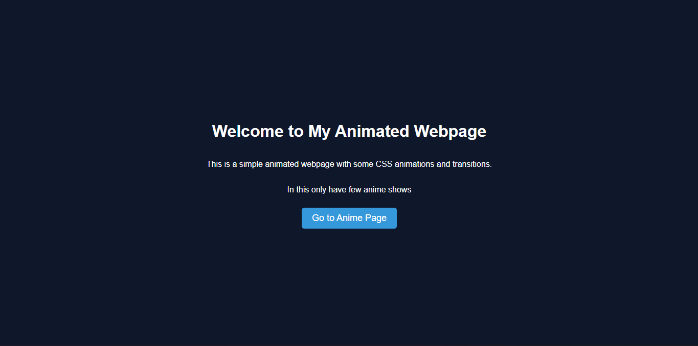
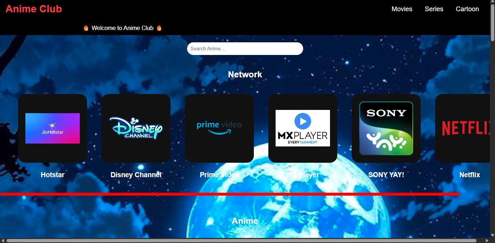
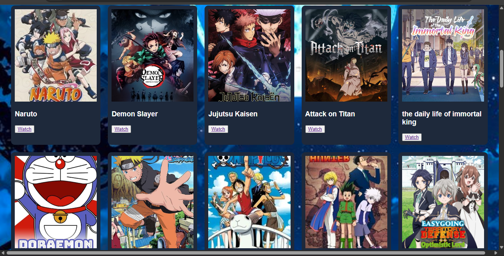
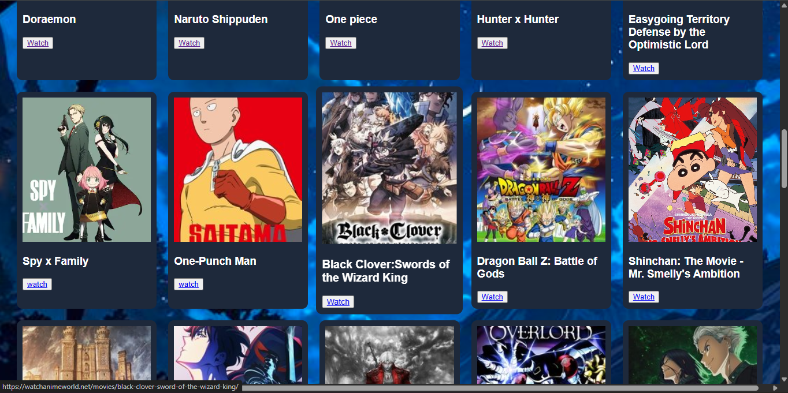
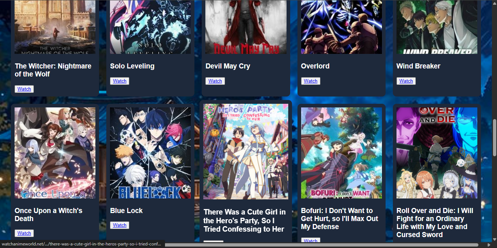
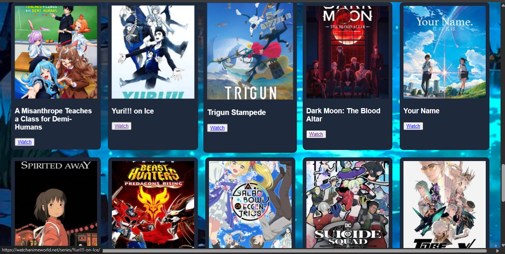
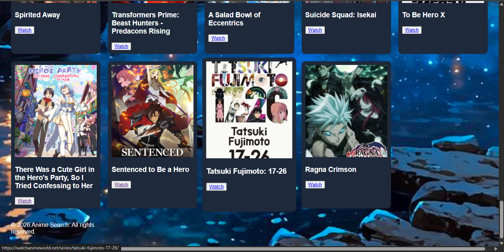

# 🎌 Anime Club – HTML & CSS Project

## 📌 Project Description
This is a simple animated website created using HTML and CSS.
The project is designed for anime lovers where users can explore anime content.

## 🚀 Features
- Animated homepage
- Stylish buttons and effects
- Navigation to anime page
- Responsive layout

## 🖼️ Screenshots

### 🏠 Home Page

### 🎬 Anime Page

## 🛠️ Technologies Used
- HTML
- CSS

## 📂 Project Files
- miniproject1.html
- miniproject12.html

## 🔗 GitHub Link
https://github.com/singamsridhar/anime-club

## 👨‍💻 Author
Sridhar  
CSE Student
NC.SC.U4CSE25048
